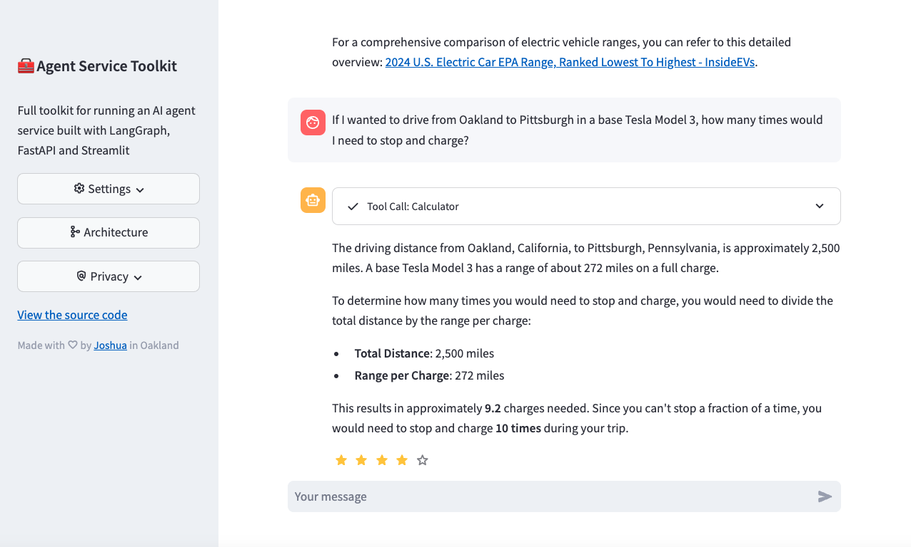

# 🧰 AI 智能体服务工具包

[](https://github.com/JoshuaC215/agent-service-toolkit/actions/workflows/test.yml) [](https://codecov.io/github/JoshuaC215/agent-service-toolkit) [](https://github.com/JoshuaC215/agent-service-toolkit/blob/main/pyproject.toml)
[](https://github.com/JoshuaC215/agent-service-toolkit/blob/main/LICENSE) [](https://agent-service-toolkit.streamlit.app/)

一套完整的 AI 智能体服务工具包，基于 LangGraph、FastAPI 和 Streamlit 构建。

本工具包包含一个 [LangGraph](https://langchain-ai.github.io/langgraph/) 智能体、一个用于提供智能体服务的 [FastAPI](https://fastapi.tiangolo.com/) 服务、一个与服务交互的客户端，以及一个使用该客户端提供聊天界面的 [Streamlit](https://streamlit.io/) 应用。数据结构和配置基于 [Pydantic](https://github.com/pydantic/pydantic) 构建。

本项目提供了一个模板，帮助你使用 LangGraph 框架轻松构建并运行自己的智能体。它展示了从智能体定义到用户界面的完整配置，并通过一套完整、稳健的工具降低 LangGraph 项目的上手门槛。

**[🎥 观看仓库和应用的视频演示](https://www.youtube.com/watch?v=pdYVHw_YCNY)**

## 概览

### [试用应用！](https://agent-service-toolkit.streamlit.app/)

<a href="https://agent-service-toolkit.streamlit.app/"></a>

### 快速开始

使用 Python 直接运行

```sh
# 至少需要一个 LLM API 密钥
echo 'OPENAI_API_KEY=your_openai_api_key' >> .env

# 推荐使用 uv 安装 agent-service-toolkit，也可以使用 "pip install ."
# uv 的安装方式请参阅：https://docs.astral.sh/uv/getting-started/installation/
curl -LsSf https://astral.sh/uv/0.11.29/install.sh | sh

# 安装依赖。"uv sync" 会自动创建 .venv
uv sync --frozen
source .venv/bin/activate
python src/run_service.py

# 在另一个终端中运行
source .venv/bin/activate
streamlit run src/streamlit_app.py
```

使用 Docker 运行

```sh
echo 'OPENAI_API_KEY=your_openai_api_key' >> .env
docker compose watch
```

### 架构图


### 主要功能

1. **LangGraph 智能体及最新特性**：使用 LangGraph 框架构建的可自定义智能体。实现了 LangGraph v1.0 的最新特性，包括通过 `interrupt()` 实现人机协同、通过 `Command` 实现流程控制、通过 `Store` 实现长期记忆，以及支持 `langgraph-supervisor`。
1. **FastAPI 服务**：通过流式和非流式端点提供智能体服务。
1. **高级流式传输**：以一种新颖的方式同时支持基于令牌和基于消息的流式传输。
1. **AG-UI 协议支持**：每个智能体也会通过 [AG-UI 协议](https://docs.ag-ui.com) 提供服务，以便连接 CopilotKit 等兼容 AG-UI 的前端，详见[文档](docs/AGUI.md)。
1. **Streamlit 界面**：提供易用的聊天界面，用于与智能体交互，并支持语音输入和输出。
1. **多智能体支持**：在服务中运行多个智能体，并通过 URL 路径调用。可用的智能体和模型在 `/info` 中说明。
1. **异步设计**：使用 async/await 高效处理并发请求。
1. **内容审核**：使用 Safeguard 实现内容审核（需要 Groq API 密钥）。
1. **RAG 智能体**：使用 ChromaDB 实现基础 RAG 智能体，详见[文档](docs/RAG_Assistant.md)。
1. **反馈机制**：包含与 LangSmith 集成的星级反馈系统。
1. **Docker 支持**：包含 Dockerfile 和 Docker Compose 文件，便于开发和部署。
1. **测试**：为整个仓库提供完善的单元测试和集成测试。

### 关键文件

仓库结构如下：

- `src/agents/`：定义多个具有不同能力的智能体
- `src/schema/`：定义协议模式
- `src/core/`：核心模块，包括 LLM 定义和配置
- `src/service/service.py`：用于提供智能体服务的 FastAPI 服务
- `src/client/client.py`：用于与智能体服务交互的客户端
- `src/streamlit_app.py`：提供聊天界面的 Streamlit 应用
- `tests/`：单元测试和集成测试

## 配置与使用

1. 克隆仓库：

   ```sh
   git clone https://github.com/JoshuaC215/agent-service-toolkit.git
   cd agent-service-toolkit
   ```

2. 配置环境变量：
   在根目录中创建 `.env` 文件。至少需要一个 LLM API 密钥或相关配置。可参阅 [`.env.example` 文件](./.env.example)获取所有可用环境变量，包括多种模型提供商的 API 密钥、基于请求头的身份验证、LangSmith 追踪、测试与开发模式，以及 OpenWeatherMap API 密钥。

3. 现在可以使用 Docker 或仅使用 Python，在本地运行智能体服务和 Streamlit 应用。推荐使用 Docker，以简化环境配置，并在代码变更时立即重新加载服务。

### 特定 AI 提供商的额外配置

- [配置 Ollama](docs/Ollama.md)
- [配置 VertexAI](docs/VertexAI.md)
- [使用 ChromaDB 配置 RAG](docs/RAG_Assistant.md)

### 构建或自定义智能体

要根据自己的使用场景自定义智能体：

1. 将新智能体添加到 `src/agents` 目录。你可以复制 `research_assistant.py` 或 `chatbot.py`，然后修改其行为和工具。
1. 在 `src/agents/agents.py` 中导入新智能体，并将其添加到 `agents` 字典。可以通过 `/<your_agent_name>/invoke` 或 `/<your_agent_name>/stream` 调用该智能体。
1. 调整 `src/streamlit_app.py` 中的 Streamlit 界面，使其与智能体的能力相匹配。

### 处理私密凭证文件

如果智能体或所选 LLM 需要基于文件的凭证或证书，可以使用项目提供的 `privatecredentials/` 目录进行开发。除 `.gitkeep` 文件外，该目录中的所有内容都会被 Git 和 Docker 构建过程忽略。建议用法请参阅[使用基于文件的凭证](docs/File_Based_Credentials.md)。

### Docker 配置

本项目包含 Docker 配置，便于开发和部署。`compose.yaml` 文件定义了三个服务：`postgres`、`agent_service` 和 `streamlit_app`。每个服务的 `Dockerfile` 都位于各自对应的目录中。

本地开发时，推荐使用 [docker compose watch](https://docs.docker.com/compose/file-watch/)。检测到源代码变更后，该功能会自动更新容器，使开发过程更加顺畅。

1. 确保系统中已安装 Docker 和 Docker Compose（版本不低于 [v2.23.0](https://docs.docker.com/compose/release-notes/#2230)）。

2. 根据 `.env.example` 创建 `.env` 文件。至少需要提供一个 LLM API 密钥（例如 `OPENAI_API_KEY`）。

   ```sh
   cp .env.example .env
   # 编辑 .env 并添加 API 密钥
   ```

3. 以监听模式构建并启动服务：

   ```sh
   docker compose watch
   ```

   该命令会自动：
   - 启动供智能体服务连接的 PostgreSQL 数据库服务
   - 使用 FastAPI 启动智能体服务
   - 启动提供用户界面的 Streamlit 应用

4. 修改代码后，服务会自动更新：
   - 相关 Python 文件和目录发生变更时，对应服务会自动更新。
   - 注意：如果修改 `pyproject.toml` 或 `uv.lock` 文件，需要运行 `docker compose up --build` 重新构建服务。

5. 在浏览器中访问 `http://localhost:8501`，打开 Streamlit 应用。

6. 智能体服务 API 位于 `http://0.0.0.0:8080`。还可以通过 `http://0.0.0.0:8080/redoc` 查看 OpenAPI 文档。

7. 使用 `docker compose down` 停止服务。

通过此配置，可以实时开发和测试变更，无需手动重启服务。

### 基于 AgentClient 构建其他应用

本仓库包含通用的 `src/client/client.AgentClient`，可用于与智能体服务交互。该客户端设计灵活，可用于在智能体之上构建其他应用。它支持同步与异步调用，以及流式与非流式请求。

有关 `AgentClient` 的完整使用示例，请参阅 `src/run_client.py` 文件。以下是一个简短示例：

```python
from client import AgentClient
client = AgentClient()

response = client.invoke("讲一个简短的笑话？")
response.pretty_print()
# ================================== AI 消息 ==================================
#
# 一个人走进图书馆，问图书管理员：“你们有关于巴甫洛夫的狗和薛定谔的猫的书吗？”
# 图书管理员回答：“听起来有点耳熟，但我不确定它在不在这里。”

```

### 使用 LangGraph Studio 开发

该智能体支持 [LangGraph Studio](https://langchain-ai.github.io/langgraph/concepts/langgraph_studio/)，这是用于开发智能体的 IDE。

运行 `uv sync` 时会安装 `langgraph-cli[inmem]`。只需按照上述说明在根目录中添加 `.env` 文件，然后运行 `langgraph dev` 启动 LangGraph Studio。可以根据需要自定义 `langgraph.json`。更多信息请参阅[本地快速入门](https://langchain-ai.github.io/langgraph/cloud/how-tos/studio/quick_start/#local-development-server)。

### 不使用 Docker 进行本地开发

也可以不使用 Docker，仅通过 Python 虚拟环境在本地运行智能体服务和 Streamlit 应用。

1. 创建虚拟环境并安装依赖：

   ```sh
   uv sync --frozen
   source .venv/bin/activate
   ```

2. 运行 FastAPI 服务器：

   ```sh
   python src/run_service.py
   ```

3. 在另一个终端中运行 Streamlit 应用：

   ```sh
   streamlit run src/streamlit_app.py
   ```

4. 打开浏览器并访问 Streamlit 提供的 URL（通常为 `http://localhost:8501`）。

## 使用 agent-service-toolkit 构建或受其启发的项目

以下是部分使用本仓库代码或受其启发的公开项目。

- **[PolyRAG](https://github.com/QuentinFuxa/PolyRAG)**：扩展 agent-service-toolkit，为 PostgreSQL 数据库和 PDF 文档提供 RAG 能力。
- **[alexrisch/agent-web-kit](https://github.com/alexrisch/agent-web-kit)**：agent-service-toolkit 的 Next.js 前端。
- **[raushan-in/dapa](https://github.com/raushan-in/dapa)**：数字逮捕防护应用（DAPA），通过易用的平台帮助用户高效举报金融诈骗和欺诈行为。

**如果有新项目需要添加，请提交修改 README 的拉取请求或发起讨论！** 我们很乐意收录更多项目。

## 贡献

欢迎贡献！请随时提交拉取请求。

**关于本仓库的维护方式：** 这是一个由单人维护的项目。在 AI 维护智能体的协助下，问题、拉取请求和讨论大约每两周集中处理一次。如果一两周内未收到回复，感谢你的耐心等待；对于真正紧急的问题（如漏洞报告等）或正在进行的拉取请求，我会尽力在几天内回复。如果你对工作方式感兴趣，可以在 [`docs/maintenance/`](docs/maintenance/) 中查看所有自动化操作手册的版本记录。

目前，测试需要在不使用 Docker 的本地开发环境中运行。要运行智能体服务的测试：

1. 确保当前位于项目根目录，并已激活虚拟环境。

2. 安装开发依赖和 pre-commit 钩子：

   ```sh
   uv sync --frozen
   pre-commit install
   ```

3. 使用 pytest 运行测试：

   ```sh
   pytest
   ```

### 可选依赖的冒烟测试

部分集成需要真实基础设施，因此不会由单元测试套件或默认 CI 流程覆盖，包括 PostgreSQL 和 MongoDB 检查点存储、AG-UI 端点，以及 LangFuse 追踪。`scripts/smoke_test.sh` 会在 Docker 中启动各项依赖，针对依赖运行服务，执行端到端集成验证（包括确认实际使用了预期后端，而不是静默回退到 SQLite），最后关闭相关服务。

```sh
./scripts/smoke_test.sh                 # 默认：postgres、mongo、agui
./scripts/smoke_test.sh mongo           # 单个目标
./scripts/smoke_test.sh langfuse        # 重量级：启动完整的 LangFuse 自托管技术栈
./scripts/smoke_test.sh all             # 全部目标，包括 langfuse
```

这些测试是供维护者或智能体选择执行的置信度检查，不属于 CI。请运行与所做变更对应的目标，无需运行全部测试。可选的附加 Compose 文件位于 `docker/` 中（例如 `docker/compose.mongo.yaml`），并叠加在默认的 `compose.yaml` 之上，从而保持默认技术栈轻量。

## 许可证

本项目采用 MIT 许可证，详情请参阅 LICENSE 文件。
