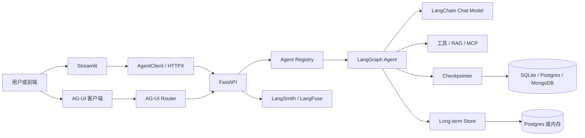
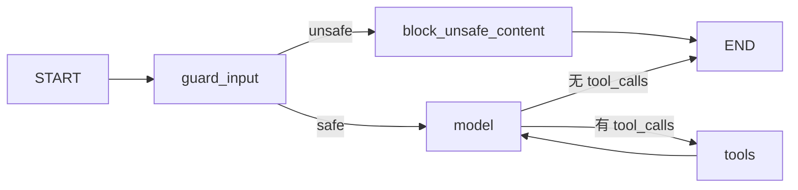

# Agent Service Toolkit 技术调研与学习路线

> 调研对象：[JoshuaC215/agent-service-toolkit](https://github.com/JoshuaC215/agent-service-toolkit)  
> 调研日期：2026-08-10  
> 上游基线：`main` 分支，提交 `5983303d53bc240e6a681620bed1e94843150db8`  
> 建议学习周期：4 周、20 个工作日，每天 2-3 小时

## 先看结论

这是一个面向 AI Agent 服务的全链路模板，不是单纯的 LangGraph 示例。它把 Agent 编排、模型适配、HTTP API、流式协议、会话持久化、前端、可观测性、容器化和测试放在同一个仓库中，适合用来理解“一个 Agent 如何从 Python 函数变成可部署服务”。

真正需要优先啃透的不是十几个 Agent 示例，而是下面这条主链：

```text
Pydantic 配置与协议
  -> LangChain 模型与消息抽象
  -> LangGraph StateGraph / Pregel
  -> Checkpointer 与 Store
  -> FastAPI invoke / SSE stream
  -> AgentClient
  -> Streamlit UI
```

建议先达到以下四个目标，再看 RAG、MCP、多智能体和语音：

1. 能手画 `research-assistant` 的状态图，并解释每条条件边。
1. 能追踪一次 `/stream` 请求从 `UserInput` 到 SSE `token/message/[DONE]` 的完整路径。
1. 能说清 `run_id`、`thread_id`、`user_id` 各自解决什么问题。
1. 能复制最小 Agent、注册到服务、写一个端点测试，并用 Fake Model 跑通。

完成标准不是“把所有文件读完”，而是能独立增加一个 Agent 能力，并知道它在状态、协议、持久化、流式输出和测试五个层面分别要改什么。

## 调研基线与本地仓库差异

调研时发现，当前工作区并不是用户给出的上游仓库完整 `main`：

| 对比项 | 当前工作区 | GitHub 上游 |
| --- | --- | --- |
| 远程仓库 | `coderpwh1024/agent-service-toolkit` | `JoshuaC215/agent-service-toolkit` |
| 默认分支 | `master` | `main` |
| 当前提交 | `1938ac3` | `5983303` |
| 源码完整度 | 只有 `core/`、`schema/`、`run_service.py` 等少量文件 | 包含 `agents/`、`service/`、`client/`、`memory/`、`voice/`、Streamlit、Docker 和完整测试 |
| README 一致性 | README 描述了当前工作树中不存在的模块 | README 与源码基本一致 |

因此，本报告的架构和路线以上游 `main@5983303` 为准。当前工作区中的 README、`compose.yaml` 和 `langgraph.json` 已经引用了缺失路径，直接启动会缺少 `service`、`agents`、Dockerfile 等内容。

开始实操前，先决定是在一个新的上游克隆中学习，还是把当前 fork 与上游同步。为了不覆盖当前工作区内容，学习阶段更推荐新克隆：

```bash
git clone https://github.com/JoshuaC215/agent-service-toolkit.git agent-service-toolkit-upstream
cd agent-service-toolkit-upstream
git rev-parse HEAD
```

如果要在当前 fork 内继续开发，应先检查未提交改动，再添加 `upstream` 并设计同步策略；不要直接用强制重置覆盖当前分支。

## 项目定位与成熟度

截至调研日，GitHub 项目约有 4.4k stars、751 forks，是 GitHub Template，许可证为 MIT。项目元数据仍为 `0.1.0`、Beta，GitHub 没有正式 Release，说明它更接近持续更新的参考实现，而不是具有稳定兼容承诺的产品 SDK。

它适合学习：

- LangGraph Agent 的多种建图方式和服务化方式。
- 同一个服务注册多个 Agent、支持多个模型提供商的设计。
- Token、完整消息、自定义事件和子图事件的统一流式处理。
- Checkpointer、Store、人机中断恢复和多轮会话的组合。
- Agent API、Python Client、Streamlit UI 的纵向贯通。
- AI 应用的测试、追踪、Docker 和 CI 基线。

它不直接等于生产级平台。租户隔离、用户身份、权限、配额、限流、审计、可靠任务队列、生产数据库迁移和前端工程化仍需自行补齐。

## 总体架构



各层职责刻意分开：

- `schema/` 定义跨服务边界的数据，不包含业务流程。
- `core/` 决定哪些模型可用，以及具体创建哪个 LangChain Chat Model。
- `agents/` 负责状态、节点、边、工具和提示词。
- `memory/` 只负责选择和初始化 LangGraph 持久化实现。
- `service/` 把 HTTP 请求转换为 LangGraph 输入，把图事件转换为 API 输出。
- `client/` 隐藏 HTTP、SSE 和 Pydantic 解析细节。
- `streamlit_app.py` 只通过 `AgentClient` 访问服务，不直接调用图。

这种分层是本项目最值得复用的部分。

## 技术栈拆解

| 层次 | 主要技术 | 在项目中的作用 | 优先级 |
| --- | --- | --- | --- |
| 语言与包管理 | Python 3.12-3.14、`uv`、`uv.lock` | 异步服务、依赖锁定、开发命令 | P0 |
| Agent 编排 | LangGraph 1.2 | 状态图、条件路由、工具循环、中断、持久化、子图 | P0 |
| LLM 抽象 | LangChain 1.3 | 消息、Runnable、工具绑定、模型适配器 | P0 |
| API | FastAPI、Uvicorn | 生命周期、依赖注入、鉴权、普通与流式端点 | P0 |
| 数据校验 | Pydantic 2、pydantic-settings | 请求响应 schema、环境配置、密钥类型、模型枚举 | P0 |
| HTTP 与流式 | HTTPX、SSE | 同步/异步客户端、Token 和消息事件流 | P0 |
| 短期记忆 | LangGraph Checkpointer | 按 `thread_id` 保存图状态和会话历史 | P1 |
| 长期记忆 | LangGraph Store | 按 `user_id` 命名空间保存跨线程数据 | P1 |
| 数据库 | SQLite、PostgreSQL、MongoDB | Checkpoint 和 Store 后端 | P1 |
| 前端 | Streamlit | Agent 选择、模型选择、会话、流式渲染、反馈 | P1 |
| 测试质量 | Pytest、pytest-asyncio、Ruff、Pyrefly、Codecov | 单元、API、UI、容器和冒烟测试 | P1 |
| RAG | Chroma、ONNX Runtime、PyPDF、Tiktoken | 本地向量库和文档问答 | P2 |
| 云知识库 | Amazon Bedrock Knowledge Bases | 显式 retrieve -> augment -> generate 示例 | P2 |
| 多智能体 | langgraph-supervisor | Supervisor、handoff、层级子图 | P2 |
| 标准前端协议 | AG-UI、ag-ui-langgraph | 向 CopilotKit 等前端输出标准 Agent 事件 | P2 |
| 工具协议 | MCP、langchain-mcp-adapters | 运行时加载 GitHub MCP 工具 | P2 |
| 可观测性 | LangSmith、LangFuse | Trace、回调、用户反馈 | P2 |
| 语音 | OpenAI STT/TTS | Streamlit 语音输入和语音播放 | P3 |
| 交付 | Docker Compose、GitHub Actions、Azure Web App | 本地编排、CI、镜像和服务部署 | P2 |

### LangChain 与 LangGraph 的边界

这两个名字经常被混用，但在本项目里职责不同：

- LangChain 提供 `AIMessage`、`HumanMessage`、`ToolMessage`、Chat Model、`RunnableConfig`、`bind_tools()` 和各种模型/检索器适配器。
- LangGraph 把这些对象组织成有状态工作流，提供 `StateGraph`、`MessagesState`、`ToolNode`、`Command`、`interrupt()`、Checkpointer、Store 和多种流模式。

可以把 LangChain 理解为“模型与组件协议”，LangGraph 理解为“状态机与执行运行时”。

### 配置与模型工厂

`src/core/settings.py` 使用 `BaseSettings` 从 `.env` 和环境变量读取配置，并在初始化阶段完成：

- 至少一个模型提供商可用性的校验。
- `DEFAULT_MODEL` 自动选择。
- `AVAILABLE_MODELS` 白名单计算。
- SQLite、Postgres、Mongo、认证和 Trace 参数读取。
- `SecretStr` 包装敏感值。

`src/schema/models.py` 用多个 `StrEnum` 表示提供商模型；`src/core/llm.py` 再将统一枚举映射到不同 LangChain Chat Model。`get_model()` 使用 `@cache`，相同模型在进程内复用。

支持的接入面很广：OpenAI、Azure OpenAI、DeepSeek、Anthropic、Google AI、Vertex AI、Groq、AWS Bedrock、Ollama、OpenRouter、OpenAI Compatible 和 Fake Model。

学习时不要逐个研究提供商。先只看 Fake Model 和一个真实提供商，理解“配置发现 -> 枚举白名单 -> 工厂实例化 -> 请求级选模”即可。

### Agent 注册与加载

`src/agents/agents.py` 是 Agent 控制面：

- `agents` 字典维护 URL key、描述和图实例。
- `DEFAULT_AGENT` 决定无 `agent_id` 路径时使用哪个 Agent。
- `AgentGraph` 统一 `CompiledStateGraph` 和函数式 API 返回的 `Pregel`。
- `LazyLoadingAgent` 为 MCP 这类需要异步连接的 Agent 延迟创建图。
- FastAPI 启动时调用 `load_agent()`，再给每个图注入 Checkpointer 与 Store。

新增 Agent 的最小闭环是“创建图 -> 在注册表登记 -> 为行为和加载增加测试”，而不是修改服务端点。

### Agent 示例地图

| Agent | 展示的核心能力 | 阅读建议 |
| --- | --- | --- |
| `chatbot` | `@entrypoint` 函数式 API、保存 previous state | 第一个读 |
| `research-assistant` | `StateGraph`、安全节点、模型/工具循环、条件边 | 核心必读 |
| `rag-assistant` | Chroma 检索作为模型工具 | 理解 Tool-based RAG |
| `knowledge-base-agent` | AWS KB、显式检索节点、上下文增强节点 | 对比 Pipeline RAG |
| `interrupt-agent` | `interrupt()`、恢复执行、Store 跨线程记忆 | 核心必读 |
| `command-agent` | `Command` 同时更新状态并控制跳转 | 短小必读 |
| `bg-task-agent` | `StreamWriter` 和 custom stream events | 学流式时读 |
| `langgraph-supervisor-agent` | Supervisor 向专业子 Agent 分派任务 | 主链掌握后读 |
| `langgraph-supervisor-hierarchy-agent` | 嵌套 Supervisor 和子图事件 | 后读 |
| `github-mcp-agent` | MCP、异步加载、动态工具创建 Agent | 有 MCP 需求再读 |

`research-assistant` 的关键循环如下：



读这个图时重点观察：

- `MessagesState` 如何通过 reducer 累积消息。
- 节点为何返回 `{"messages": [response]}` 而不是整个 state。
- `RunnableConfig.configurable` 如何把请求级模型传入节点。
- `RemainingSteps` 如何防止工具循环耗尽图递归预算。
- `ToolNode` 如何读取最后一个 AI 消息的 `tool_calls` 并追加 `ToolMessage`。

### API 与一次请求的生命周期

`src/service/service.py` 是全项目最重要的集成文件。

服务启动阶段：

1. `lifespan()` 根据配置创建 Checkpointer 和 Store。
1. 对支持 `setup()` 的后端建表或建索引。
1. 加载异步 Agent，例如 GitHub MCP Agent。
1. 把同一个 saver/store 注入所有已注册图。
1. FastAPI 开始接收请求。

普通请求阶段：

1. Pydantic 将 JSON 校验为 `UserInput`。
1. `_handle_input()` 生成 `run_id`，补齐 `thread_id` 和 `user_id`。
1. 校验请求模型是否属于 `AVAILABLE_MODELS`。
1. 合并非保留的 `agent_config`，挂载 LangFuse callback。
1. 读取当前 thread state，判断是否存在待恢复的 interrupt。
1. 新请求输入为 `HumanMessage`；恢复请求输入为 `Command(resume=...)`。
1. `agent.ainvoke()` 执行图，服务将最后一个结果转为 `ChatMessage`。

主要端点：

| 端点 | 作用 | 备注 |
| --- | --- | --- |
| `GET /info` | Agent、模型和默认值发现 | Client/UI 初始化依赖它 |
| `POST /invoke` | 调用默认 Agent | 只返回最后一条消息或 interrupt |
| `POST /{agent_id}/invoke` | 调用指定 Agent | 多 Agent 路由 |
| `POST /stream` | 默认 Agent SSE | 输出完整消息、Token、自定义事件 |
| `POST /{agent_id}/stream` | 指定 Agent SSE | 主流式接口 |
| `POST /history` | 读取默认 Agent 的 thread history | 依赖 Checkpointer |
| `POST /{agent_id}/history` | 读取指定 Agent history | Agent 参与解释图状态 |
| `POST /feedback` | 将 run 反馈写入 LangSmith | 服务端持有凭证 |
| `POST /agui/run` | 默认 Agent 的 AG-UI 流 | 使用标准协议事件 |
| `POST /agui/{agent_id}/run` | 指定 Agent 的 AG-UI 流 | 可接 CopilotKit |
| `GET /health` | 基础健康检查 | 开启 LangFuse 时也检查连接 |

### 流式传输是全项目难点

服务同时请求 `updates`、`messages`、`custom` 三种 LangGraph stream mode，并开启 `subgraphs=True`：

- `updates` 表示节点完成后的状态增量，服务将其中的 LangChain 消息转换成 `ChatMessage`。
- `messages` 表示 LLM 生成的 `AIMessageChunk`，服务将文本部分转换成 token 事件。
- `custom` 表示节点通过 `StreamWriter` 主动发出的业务进度，例如后台任务状态。
- 子图会多一层 node path；Supervisor 的 handoff/handoff-back 还需要特殊过滤。

最终 SSE 只有四种客户端可见形态：

```text
data: {"type":"token","content":"Hel"}
data: {"type":"message","content":{...ChatMessage...}}
data: {"type":"error","content":"..."}
data: [DONE]
```

这里要特别理解“token 用于即时显示”和“message 用于形成可信会话记录”的区别。UI 不能简单把两者都追加到历史，否则会重复内容。

AG-UI 端点则使用官方 `ag-ui-langgraph` 做事件翻译，并主动过滤 `RAW` 事件，避免把服务端完整提示词和内部事件暴露给客户端。

### 三类 ID 与两类记忆

| 概念 | 生命周期 | 用途 | 是否是安全身份 |
| --- | --- | --- | --- |
| `run_id` | 单次图执行 | Trace、反馈、关联一次响应 | 否 |
| `thread_id` | 一段会话 | Checkpointer key、多轮消息和中断恢复 | 否 |
| `user_id` | 多段会话 | Store namespace、跨 thread 长期数据 | 否 |

项目有两套容易混淆的记忆机制：

- Checkpointer 保存整个图的 thread state，是“短期会话记忆”。SQLite、Postgres、Mongo 都可作为后端。
- Store 保存 Agent 主动读写的业务数据，是“长期记忆”。`interrupt-agent` 用 `(user_id,)` 命名空间保存生日。

当前实现中，Postgres 同时提供持久化 Checkpointer 和 Store；SQLite 的 Checkpointer 持久化，但 Store 只是进程内 `InMemoryStore`；MongoDB 只有 Checkpointer，Store 仍回退到内存。这直接决定了服务重启后哪些数据还能保留。

`user_id` 是客户端提交的命名空间，不是经过认证的用户身份；`thread_id` 也不是访问控制凭据。生产环境必须把它们绑定到服务端验证过的主体。

### Client 与 Streamlit

`AgentClient` 同时提供：

- `invoke()` / `ainvoke()`。
- `stream()` / `astream()`。
- `get_history()`。
- `acreate_feedback()`。
- `/info` 自动发现和 Agent 合法性校验。
- 可选的全局 Bearer Secret。

`src/streamlit_app.py` 不直接 import Agent 图，而是完全走 Client。这使 UI 与服务可独立部署，也是正确的边界。

Streamlit 主要管理：

- `st.session_state` 中的 client、messages、thread、model 和 Agent。
- URL query parameter 中的 `user_id` / thread 分享。
- token 增量渲染、完整 message 入历史、工具调用和 Supervisor 子消息展示。
- LangSmith 星级反馈。
- 语音输入和输出。

前端代码约 600 行，包含大量展示分支。学习时先看 Client，再只追 `main() -> draw_messages()`，不要一开始陷入具体 widget。

### RAG、MCP 与多智能体

项目展示了两种 RAG：

- `rag-assistant` 把 Chroma 检索封装成工具，由模型决定何时搜索。
- `knowledge-base-agent` 使用固定图流程先检索 AWS Knowledge Base，再增强 prompt，最后生成。

前者灵活但依赖模型正确调用工具，后者流程稳定、容易测试和观测。做业务系统时应根据“是否允许模型跳过检索”选择，而不是默认照抄其中一个。

GitHub MCP Agent 继承 `LazyLoadingAgent`，在 FastAPI lifespan 中异步连接 MCP Server、获取工具，再用 `create_agent()` 动态创建图。没有 PAT 时仍创建一个无工具图，避免整个服务无法启动。

Supervisor 示例展示任务转交，但其流式消息包含 handoff tool、子 Agent 内容和 handback tool，因此服务端和 UI 都有专门处理逻辑。它的复杂度不只在建图，还在事件协议和历史重放。

### 可观测性与工程化

- LangSmith：LangChain/LangGraph trace 和用户反馈。
- LangFuse：通过 callback 记录调用链，`/health` 可检查连接。
- Docker：服务镜像安装全部服务依赖；UI 镜像只安装 `client` dependency group。
- Compose：默认启动 Postgres、FastAPI 和 Streamlit，并使用 Compose Watch 同步源码。
- CI：Python 3.12、3.13、3.14 矩阵，执行 Ruff、Pyrefly、Pytest/Codecov、Markdown lint、Docker build 和容器端到端测试。
- 冒烟测试：额外覆盖 Postgres、Mongo、AG-UI 和 LangFuse 等默认 CI 不覆盖的真实集成。

上游快照约有 129 个测试函数，重点覆盖 settings、模型工厂、API、SSE、AG-UI、Client、Streamlit、语音、Agent 加载、持久化和 Docker E2E。读测试通常比读 README 更快确定真实行为。

## 必读文件顺序

不要按文件树从上到下读。按下面的调用关系阅读，每读完一组都做一个小实验：

1. `src/schema/schema.py`、`src/schema/models.py`：先认识外部协议和模型类型。
1. `src/core/settings.py`、`src/core/llm.py`：理解启动配置、模型白名单和请求级选模。
1. `src/agents/chatbot.py`：看最小函数式 Agent。
1. `src/agents/research_assistant.py`：手画 StateGraph 和工具循环。
1. `src/agents/agents.py`、`src/agents/lazy_agent.py`：理解注册与加载。
1. `src/memory/__init__.py` 和三个后端：区分 Checkpointer 与 Store。
1. `src/service/utils.py`、`src/service/service.py`：追 invoke、stream、history、lifespan。
1. `src/client/client.py`：从消费者角度确认 API 契约。
1. `src/streamlit_app.py`：只追初始化、流式绘制和历史重放。
1. `src/agents/interrupt_agent.py`、`command_agent.py`、`bg_task_agent/`：掌握中断、控制流和 custom events。
1. `src/service/agui.py`：理解标准 Agent UI 协议适配。
1. RAG、Supervisor、MCP、Voice：按自己的业务方向选择。
1. 对应 `tests/`：反向确认边界、异常路径和 mock 策略。

## 学习重点分级

### P0：必须吃透

- Python async/await、async generator、async context manager。
- LangChain message、tool call、Runnable 和 Chat Model。
- LangGraph state、node、edge、conditional edge、ToolNode。
- FastAPI lifespan、依赖、Pydantic request/response。
- SSE 的事件格式、断流、结束标记和错误处理。
- 从 API 到图再回到 Client 的完整调用链。

### P1：形成工程能力

- Checkpointer 与 Store 的数据边界。
- interrupt 恢复与 `Command(resume=...)`。
- Agent 注册、Lazy Loading、请求级配置。
- Fake Model、TestClient、AsyncMock 和流式测试。
- Docker 分层和服务/UI 依赖隔离。

### P2：按业务方向选择

- 企业知识库：优先 RAG、检索质量和引用。
- 复杂协作：优先 Supervisor、子图和事件建模。
- 工具生态：优先 MCP、鉴权和工具权限。
- 前端互通：优先 AG-UI。
- 线上运营：优先 LangSmith、LangFuse、成本和延迟指标。

### P3：前期可以略读

- 每个模型提供商的细枝末节。
- Streamlit 的视觉实现。
- 语音 Provider Factory。
- 维护者自动化和依赖刷新脚手架。
- 一开始就运行 LangFuse 全家桶或所有可选冒烟测试。

## 四周标准学习周期

以下按已有 Python 和基础 Web API 经验、每天 2-3 小时设计。Python 或异步基础较弱时扩展到 6-8 周；全职投入可压缩到 2 周，但阶段产出不要省略。

### 第 1 周：跑通最小闭环

目标：能从配置走到一个最小 Agent 响应。

| 天数 | 内容 | 当天产出 |
| --- | --- | --- |
| Day 1 | 获取完整上游、`uv sync --frozen`、Fake Model 启动、访问 `/info` | 环境记录和启动截图/日志 |
| Day 2 | Schema、Settings、Model Enum、`get_model()` | 一张“环境变量到模型实例”图 |
| Day 3 | `chatbot` 与 LangGraph 函数式 API | 修改一个最小 system behavior 并跑测试 |
| Day 4 | `research-assistant` StateGraph | 手画节点、边和 state 字段 |
| Day 5 | 新增一个只有单工具的练习 Agent | API 可调用，至少一个单元测试 |

周验收：不用看源码，讲清输入 JSON 如何变成 LangChain Message，如何进入图，又如何变成响应 JSON。

### 第 2 周：服务、流式与客户端

目标：吃透最关键的服务化链路。

| 天数 | 内容 | 当天产出 |
| --- | --- | --- |
| Day 6 | FastAPI lifespan、Agent 注入、Bearer 校验 | 启动时序图 |
| Day 7 | `_handle_input()` 与 `/invoke` | 请求字段追踪表 |
| Day 8 | `message_generator()` 与三种 stream mode | 保存一份真实 SSE 事件样本并逐条注释 |
| Day 9 | `AgentClient` 同步/异步、普通/流式 API | 一个命令行 Client 小程序 |
| Day 10 | Streamlit 的 `main()` 与 `draw_messages()` | 能解释 token 与 message 去重逻辑 |

周验收：自己写一个最小 SSE 客户端，正确处理 `token`、`message`、`error` 和 `[DONE]`。

### 第 3 周：状态、记忆与高级流程

目标：理解 Agent 服务区别于无状态 LLM API 的部分。

| 天数 | 内容 | 当天产出 |
| --- | --- | --- |
| Day 11 | SQLite Checkpointer、多轮 thread、history | 同一 `thread_id` 连续对话实验 |
| Day 12 | Postgres saver/store、`user_id` namespace | Checkpointer/Store 数据边界说明 |
| Day 13 | `interrupt-agent` 与 `Command(resume)` | 一次暂停、恢复、跨线程取生日演示 |
| Day 14 | `command-agent`、后台 custom events | 一个带进度事件的节点 |
| Day 15 | AG-UI 与原生 SSE 的对比 | 两套协议映射表 |

周验收：能回答“服务重启、换 thread、换 user、换 Agent”四种情况下状态分别如何变化。

### 第 4 周：扩展能力与生产视角

目标：形成能改、能测、能上线前评估的能力。

| 天数 | 内容 | 当天产出 |
| --- | --- | --- |
| Day 16 | Chroma RAG 与 AWS KB 两种模式 | 检索作为工具 vs 固定检索节点对比 |
| Day 17 | Supervisor、子图、MCP Lazy Loading | 选择其中一个跑通并画事件序列 |
| Day 18 | Pytest 分层、Ruff、Pyrefly、CI、Smoke Test | 为自己的 Agent 补齐测试 |
| Day 19 | Docker Compose、Trace、健康检查 | 容器启动和一条可检索 trace |
| Day 20 | 生产差距评估与二次开发设计 | 一份自己的改造 ADR/技术方案 |

周验收：交付一个小型业务 Agent，包含 schema、图、工具、持久化选择、流式输出、测试和运行说明。

## 两周强化版

全职学习时可压缩为 10 天：

1. Day 1：环境、schema、settings、模型工厂。
1. Day 2：chatbot 与 research graph。
1. Day 3：FastAPI lifespan、invoke。
1. Day 4：SSE 和 Client。
1. Day 5：Streamlit 和端到端调试。
1. Day 6：Checkpointer、Store、Postgres。
1. Day 7：interrupt、Command、custom events。
1. Day 8：RAG、AG-UI。
1. Day 9：Supervisor 或 MCP、测试和 Trace。
1. Day 10：独立实现一个 Agent 并做技术复盘。

不要通过跳过实操来压缩周期。可以少看一个扩展模块，但主链必须亲手跑通。

## 第一天实操清单

以下命令应在完整上游源码中运行。Fake Model 不需要真实 LLM API Key：

```bash
uv sync --frozen
USE_FAKE_MODEL=true uv run python src/run_service.py
```

另开终端检查服务：

```bash
curl http://localhost:8080/info

curl -X POST http://localhost:8080/chatbot/invoke \
  -H 'Content-Type: application/json' \
  -d '{"message":"hello","thread_id":"study-thread-1","user_id":"study-user-1"}'

curl -N -X POST http://localhost:8080/research-assistant/stream \
  -H 'Content-Type: application/json' \
  -d '{"message":"hello","stream_tokens":true,"thread_id":"study-thread-2"}'
```

运行 UI：

```bash
AGENT_URL=http://localhost:8080 uv run streamlit run src/streamlit_app.py
```

第一天只验证五件事：

- `/info` 能看到 Agent 和 Fake Model。
- `/invoke` 返回结构化 `ChatMessage`。
- `/stream` 以 `[DONE]` 结束。
- 相同 `thread_id` 可以读取历史。
- Streamlit 能通过 Client 完成一次对话。

## 推荐实操作业

### 作业一：最小天气 Agent

创建一个只包含 `model` 和 `weather_tool` 的图，注册为 `weather-agent`，使用 Fake Tool 或 mock，不依赖真实 API。测试安全输入、工具调用和最终响应。

目的：掌握状态图、工具节点、注册表和测试闭环。

### 作业二：可恢复审批流

创建一个“生成操作计划 -> 请求人工确认 -> 执行或取消”的图，使用 `interrupt()` 暂停，用同一 `thread_id` 恢复。

目的：掌握 Checkpointer、interrupt 和 `Command(resume)`。

### 作业三：带进度的文档处理

让节点通过 `StreamWriter` 输出 `queued/running/complete/error`，Client 正确解析 custom message，UI 展示进度但不把进度文本混入最终回答。

目的：掌握业务事件与 LLM token 的分离。

### 作业四：业务 RAG 对比

对同一份 PDF 分别实现“检索工具”和“固定检索节点”，比较：

- 是否每次都检索。
- 检索失败如何处理。
- 引用是否稳定。
- 测试是否容易。
- Trace 是否容易阅读。

目的：根据业务约束选择 Agentic RAG 或 Pipeline RAG。

## 测试与调试策略

建议按从便宜到昂贵的顺序验证：

1. 纯函数测试：schema 转换、路由函数、工具函数。
1. 图测试：Fake Model 或 mock model，验证 state updates 和条件边。
1. API 测试：FastAPI `TestClient`，mock Agent。
1. Client 测试：mock HTTPX response 和 SSE line。
1. 真实图 E2E：Fake Model + SQLite。
1. Docker E2E：服务镜像和 UI 镜像。
1. 目标冒烟测试：只在涉及 Postgres、Mongo、AG-UI、LangFuse 时运行相应目标。

常用质量命令：

```bash
uv run pytest
uv run ruff check .
uv run ruff format --check .
uv run pyrefly check
uv run pymarkdown scan README.md docs/
```

调试流式接口时，不要只看 UI。先用 `curl -N` 保存原始 SSE，再定位问题属于图事件、服务转换、Client 解析还是 UI 渲染。

## 生产化重点与风险

### 身份与权限

`AUTH_SECRET` 只是可选的全局共享 Bearer Secret。`user_id` 和 `thread_id` 都由客户端提交，不能作为身份或所有权证明。生产改造至少需要：

- 接入真实身份提供方，服务端验证 JWT/session。
- 从认证主体派生 tenant/user namespace，不接受任意覆盖。
- 对 thread、history、Store 和 MCP tool 做资源级授权。
- 对高成本模型和工具增加配额、限流、超时和审计。

### 数据一致性

- SQLite Store 是内存实现，重启丢失长期记忆。
- Mongo 暂无对应长期 Store。
- Postgres saver 和 store 使用不同连接池，需按并发量调整 pool。
- 项目没有业务表迁移框架；LangGraph `setup()` 只解决自己的表结构。
- 删除、归档、保留期限和隐私清除流程需要补充。

### API 契约

- `/invoke` 只返回最后一条消息，工具中间消息和多个 AI 消息会被省略。
- 原生 SSE 是项目自定义协议，前端生态互通应优先评估 AG-UI。
- 流式错误以事件返回，HTTP 可能已经是 200，客户端必须检查 `error` event。
- Supervisor 流式过滤依赖节点命名和消息形态，升级 LangGraph/开源库时要重点回归。

### Agent 安全

- Safeguard 是模型分类节点，不应替代输入验证、工具权限和输出策略。
- MCP/GitHub 工具可能产生真实外部副作用，需要最小权限、人工确认和审计。
- RAG 文档和工具返回值同样可能包含 prompt injection。
- AG-UI 已过滤 RAW events，但自定义流仍需检查是否泄露内部数据。
- Trace 平台可能记录 prompt、用户数据和工具结果，需要脱敏与保留策略。

### 可靠性与成本

- 需要为模型、工具、数据库和外部 MCP 设置独立超时、重试和熔断策略。
- `@cache` 的模型实例需确认具体 SDK 的并发安全和连接生命周期。
- 长任务不应依赖 Web 进程内 `asyncio.sleep()` 示例，应使用可靠队列/任务系统。
- 多 worker 部署时不能依赖内存 Store 或单进程 Streamlit session。
- 建议记录每次 run 的 token、费用、首 token 延迟、总延迟、工具成功率和中断恢复率。

## 容易走偏的地方

- 一开始研究所有模型 API。模型工厂模式比供应商参数更重要。
- 把 `user_id` 当登录用户，把 `thread_id` 当私有链接。
- 认为配置了 SQLite 就拥有持久化长期记忆。
- 只看最终回答，不看 state updates、tool messages 和原始 SSE。
- 先改 600 行 Streamlit，再理解 Client/API 契约。
- 看到很多 Agent 示例就直接学 Supervisor；先把单图工具循环吃透。
- 把模型 Guardrail 当成完整安全方案。
- 为了“测试全面”每次都启动所有基础设施；应按改动选择目标冒烟测试。

## 二次开发建议

如果准备基于此项目做自己的产品，建议按以下顺序收敛模板：

1. 删除不需要的模型提供商和示例 Agent，缩小依赖与攻击面。
1. 固定一个业务输入/输出 schema，不让前端直接依赖任意 `ChatMessage` 细节。
1. 接入真实认证，将 tenant/user 从可信 token 注入 `RunnableConfig`。
1. 选择唯一的生产 Checkpointer/Store 后端，明确数据保留策略。
1. 为工具建立权限、幂等、超时、重试和人工确认边界。
1. 决定使用项目 SSE 还是 AG-UI，并把事件契约版本化。
1. 建立离线评测集、线上 trace、成本和质量指标。
1. 最后再替换 Streamlit 为正式前端或保留为内部调试台。

一个合理的首个业务改造，不应同时保留全部 Agent、全部 Provider、三种数据库和两种前端协议。模板展示广度，产品需要主动收敛。

## 学完后的验收问题

能独立回答下面的问题，基本算啃下了项目主干：

1. `MessagesState` 为什么能追加消息，普通 dict 为什么不一定可以？
1. `ainvoke()` 和 `astream()` 的返回语义有什么不同？
1. `updates`、`messages`、`custom` 分别适合承载什么？
1. 为什么 token 和完整 AI message 都需要传给前端？
1. Checkpointer 和 Store 各自保存什么，谁负责写入？
1. interrupt 后为什么必须复用 `thread_id`？
1. 请求级模型如何从 JSON 走到具体 Chat Model？
1. 新 Agent 为什么通常不需要新增 FastAPI 路由？
1. Lazy Agent 为什么在 lifespan 中加载？
1. `/invoke` 为什么可能丢掉中间 AI 消息？
1. 原生 SSE 与 AG-UI 的取舍是什么？
1. 为什么 `user_id` 不能作为鉴权依据？
1. 哪些测试可以完全离线，哪些必须依赖 Docker 或外部服务？
1. 从模板走向生产，最先必须补的三个能力是什么？

## 参考入口

- [GitHub 仓库](https://github.com/JoshuaC215/agent-service-toolkit)
- [本次调研固定提交](https://github.com/JoshuaC215/agent-service-toolkit/tree/5983303d53bc240e6a681620bed1e94843150db8)
- [LangGraph 文档](https://docs.langchain.com/oss/python/langgraph/overview)
- [FastAPI 文档](https://fastapi.tiangolo.com/)
- [Pydantic Settings 文档](https://docs.pydantic.dev/latest/concepts/pydantic_settings/)
- [AG-UI 文档](https://docs.ag-ui.com/)
- [uv 文档](https://docs.astral.sh/uv/)
