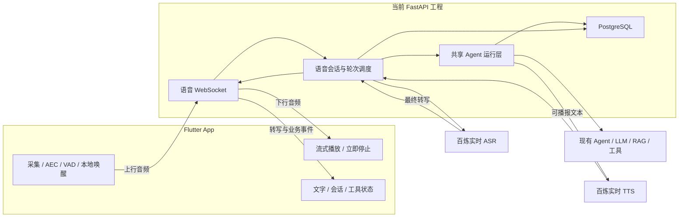

# 独立 Flutter App 与实时语音后端规划

日期：2026-09-18。状态：后端 P1/P2 主链路已经实现并通过模拟 Provider 测试；真实百炼账号联调、Flutter 工程和真机 AEC/唤醒验证仍待完成。实际接口以 [Voice_API.md](Voice_API.md) 为准。

目标：以当前 agent-service-toolkit 为唯一业务后端，在独立目录建立 Flutter 工程。手机与后端共同实现本地唤醒、连续语音对话、流式回答、说话打断和 Agent 业务。所有云端模型调用、Agent 编排、工具权限与业务数据由后端管理。

首版假设：优先 Android 真机验证，同时保留 iOS 音频接口；前台会话、中文、单个活跃语音会话。Android 后台与 iOS 后台音频分别验收。平台优先级可调整，不影响后端协议。

## 工程边界

建议两个独立 Git 仓库、独立依赖和构建流程。以下 App 名称为暂定，不表示已经创建。

```text
/Users/coderpwh/python/workspace/
├── agent-service-toolkit/       当前 Python 后端
└── agent-voice-app/             新 Flutter 工程
```

| 职责 | 当前后端工程 | Flutter 工程 |
| --- | --- | --- |
| 业务 | Agent、RAG、MCP、工具执行与确认、业务权限 | 展示业务结果、提交操作与确认 |
| 模型 | ASR、LLM、TTS，模型与音色白名单、密钥 | 接收可用配置，不持有百炼密钥 |
| 音频 | 音频流转发、格式校验、云端识别与合成 | 麦克风、扬声器、音频路由、回声消除、重采样 |
| 唤醒 | 可下发支持的唤醒配置、管理会话超时 | 本地关键词检测、唤醒提示、会话启动 |
| 轮次与打断 | 最终轮次判定、取消任务、废弃旧输出、会话一致性 | 本地快速暂停或停播、清空缓冲、报告播放进度 |
| 数据 | 登录身份、会话历史、执行记录、播放状态 | 页面状态、本地设置、有限缓存 |
| 生命周期 | 连接回收、上游超时、运行资源清理 | 权限、切后台、电话中断、蓝牙切换、重连 |

App 是轻业务客户端，但必须包含音频终端能力。AEC 与实际停播需要在手机执行；全部等待后端指令会额外增加网络往返延迟。本地唤醒与语音活动检测不属于 Agent 业务下放。

## 当前代码可复用项与缺口

| 位置 | 原有能力 | 当前后端结果 |
| --- | --- | --- |
| `src/core/llm.py`、`src/schema/models.py` | 百炼 `qwen3.8-max`，流式文字 | 保留；新增模型必须经过注册与可用性校验 |
| `src/service/service.py` | `/info`、`/invoke`、`/stream`、`/history`、`/threads` | 已提取传输无关的 Agent 事件层，并统一线程归属和运行锁 |
| `src/service/agui.py` | AG-UI SSE，复用 Agent 与检查点 | 已保持兼容，并接入用户绑定、线程归属和运行锁 |
| `src/agents/` | 多种 LangGraph Agent、RAG、MCP | 按 Agent 验收语音输出、取消与恢复能力 |
| `src/memory/postgres.py` | 检查点与跨会话 Store | 已继续复用 PostgreSQL，并新增语音会话、轮次、播放记录及归属表 |
| `src/voice/providers/alibaba_stt.py` | 完整录音 HTTP ASR，`stream=False` | 已新增 `alibaba_realtime.py` 异步实时 ASR 适配器 |
| `src/voice/providers/alibaba_tts.py` | 完整文本 HTTP 合成、完整音频返回 | 已新增流式 TTS，支持一个连接内连续提交多个语音段 |
| `src/voice/manager.py`、`src/voice/__init__.py` | Streamlit UI 与入口导入耦合 | 已改为惰性导入，服务端加载 voice 包不会触发 Streamlit |
| `docker/Dockerfile.service` | 未复制 `src/voice/` | 已加入 `voice` 和现有 Agent 所需的 `rag` 源码 |
| `compose.yaml` | voice 同步规则在 Streamlit 服务 | 已给 agent_service 加入语音配置、同步规则和兼容认证的健康检查 |

当前已经有语音 WebSocket、回答取消、播放进度、业务确认、短期用户令牌及线程归属校验。尚未实现的部分集中在独立 Flutter 工程、本地唤醒、AEC 和真机生命周期；复杂 Agent 的外部业务执行不会因用户停播而假装回滚。已有 `interrupt-agent` 是业务流程中的人在回路机制，与用户插话取消仍是两种事件。

补充：默认 Agent 是 `research-assistant`。其中 Safeguard 仅在配置 Groq Key 时实际调用相应模型，不能据节点存在就认为每轮一定有额外模型开销。首轮语音基准使用 `chatbot`，复杂 Agent 单独测量。

## 模型路线

第一版采用流式 ASR → 现有 Agent/LLM → 流式 TTS，保证当前后端继续掌握业务和对话。

| 环节 | 初始选择 | 后续决策 |
| --- | --- | --- |
| 实时识别 | `qwen3-asr-flash-realtime` | 验证中文、停顿、噪声、账号地域和实际可用版本 |
| 对话 | `qwen3.8-max` | 沿用已有注册项；按首音延迟、工具能力和成本再比较其他百炼文本模型 |
| 实时合成 | `qwen3-tts-flash-realtime`，先验证 `Cherry` | 配置音色、语速，按句或短语流式合成 |
| RAG 向量 | 现有 `qwen3.7-text-embedding` | 与语音协议独立，按原知识库流程使用 |

百炼提供实时 ASR 的 WebSocket 交互和流式 TTS。实时适配器需要实现相应协议，不能只替换当前 HTTP Provider 的模型名称。[实时 ASR](https://help.aliyun.com/zh/model-studio/real-time-speech-recognition-user-guide)、[实时 TTS](https://help.aliyun.com/zh/model-studio/realtime-tts-user-guide)

语音配置已加入后端 Settings，包括 `VOICE_ENABLED`、`VOICE_REALTIME_STT_MODEL`、`VOICE_REALTIME_TTS_MODEL`、`VOICE_REALTIME_VOICES` 和 `VOICE_REALTIME_URL`。它与现有录音文件 Provider 配置分开，百炼 Key 只留在服务端，端点可按账号地域配置。

`uv.lock` 已含 `websockets`，但不应依赖偶然的传递依赖；实现时将实际使用的 WebSocket 库声明为直接依赖，并验证服务端 WebSocket 支持。

端到端语音保留为后续可选适配器。当前百炼列有 `qwen-audio-3.0-realtime-plus/flash`，适合比较自然对话体验；若采用，需要另行设计其会话与 LangGraph 的上下文及工具调用关系，不能让两个系统同时独立决定同一轮业务。[语音对话选型](https://help.aliyun.com/zh/model-studio/s2s-model)

## 运行结构



后端内部直接使用共享 Agent 运行接口，不通过 HTTP 再请求自己的 `/stream`，也不解析自己生成的 SSE 字符串。实时接收音频、识别事件、Agent 执行、TTS 与下行发送必须能并发运行，不能在 WebSocket 接收循环里等待整轮回答结束。

共享运行层输出带 `run_id`、消息 ID、节点来源和事件类型的结构化事件。现有 SSE 继续转成原有 `token/message/error/[DONE]` 格式；语音层据此选择可播报内容。AG-UI 保持现有适配器，复用身份、线程归属和运行协调，不强行改写第三方协议实现。

## 接口与协议草案

以下接口和事件已经作为本项目应用协议实现，不是对百炼事件的原样透传。

| 接口 | 用途 |
| --- | --- |
| `GET /voice/capabilities` | 协议版本、输入输出格式、可用音色、可用 Agent 及其语音能力 |
| `POST /voice/sessions` | 创建语音会话或绑定已有线程，校验线程归属与 Agent |
| `WS /voice/sessions/{session_id}/ws` | 同时传输上行音频、下行音频和控制事件 |
| `GET /voice/sessions/{session_id}` | 断线后查询会话和运行状态 |
| `DELETE /voice/sessions/{session_id}` | 幂等结束语音会话并释放资源，不删除聊天历史 |

Flutter 通过现有 `/info` 获取模型和 Agent，使用带 Agent 路径的 `/history`、`/threads` 获取历史。语音轮次由 WebSocket 服务执行；同一句转写不能再由 App 调用 `/stream`，否则会重复执行 Agent。

`/info` 目前只列聊天模型，语音能力单独发布。API 文档保存于后端；HTTP 用 OpenAPI，WebSocket 另建版本化 JSON Schema、二进制帧说明及正常/打断/断线示例。Flutter 固定协议版本，以相同 fixture 做契约测试。

### 音频与事件

首版建议上行 PCM16 little-endian、单声道 16 kHz；下行 PCM16、单声道 24 kHz。设备按实际硬件采样率工作并显式重采样；16 kHz/24 kHz 是拟定的网络格式，不是要求麦克风硬件强制运行于该采样率。格式由会话握手确认。上行先以 20–40 ms 分块，下行大块需要重新分片。

控制消息使用 JSON，音频使用二进制 WebSocket 帧。帧携带协议版本、流标识、连接 epoch、输出轮次标识、递增序号及采样位置，避免仅凭全局“当前回答”猜测音频归属。帧上限、字节序与标识映射在 P0 固定。

| 方向 | 事件 | 含义 |
| --- | --- | --- |
| App → 后端 | `session.configure` | 协商音频配置及允许的会话设置 |
| App → 后端 | `input.speech_hint` | 本地检测到疑似插话，供后端结合 ASR/VAD 判定 |
| App → 后端 | `response.cancel` | 用户明确停止或打断当前回答 |
| App → 后端 | `playback.progress` | 实际播放的 response/segment 与采样位置 |
| App → 后端 | `playback.finished` | 当前回答音频确实播放完成 |
| App → 后端 | `approval.submit` | 提交指定业务中断的用户确认 |
| App → 后端 | `session.close` | 退出本次语音会话 |
| 后端 → App | `session.ready` | 会话与格式就绪，返回连接 epoch |
| 后端 → App | `input.started`、`input.ended` | 后端确认的说话边界 |
| 后端 → App | `transcript.partial`、`transcript.final` | 可修订的中间转写与最终转写 |
| 后端 → App | `response.started`、`text.delta` | 回答开始与可展示文字 |
| 后端 → App | `audio.segment.started`、`audio.segment.done` | 文本段与音频段的对应关系 |
| 后端 → App | `tool.started`、`tool.finished` | 工具执行状态与可展示结果 |
| 后端 → App | `approval.required` | 业务流程等待确认，带独立 interrupt ID |
| 后端 → App | `response.cancelled`、`response.done` | 输出失效或生成结束；不代表工具回滚或音频已播放完 |
| 后端 → App | `error`、`session.closed` | 可恢复错误、终止原因与连接结束 |

标识必须区分：`thread_id` 是业务对话，`session_id` 是语音会话，`turn_id` 是用户输入轮次，`run_id` 是 Agent 执行，`response_id` 是本次回答，`connection_epoch` 用于隔离重连后的旧输出。事件带唯一 `event_id`，输出带顺序号。重复取消、重复 ASR final、重复确认必须幂等。

中间转写可能修订，用于实时字幕；最终转写才提交一次 Agent。首版不做基于中间转写的推测执行。

### 流控与断线

音频、文本和下行发送队列必须有界。控制事件优先发送；尚未写入网络的旧音频可丢弃。已进入 TCP 的旧帧无法越过，客户端必须按 epoch/response_id 丢弃，不能只依赖随后到达的取消事件。

活动会话中持续上传需要的音频，包括服务端 VAD 判断结束所需的静音；不能无意丢掉静音导致云端永远等不到句末。拥塞时触发明确的轮次失败或重置，不能无限积压，也不能随意丢语音帧后仍声称完整识别。

断线后停止实时播放与上行缓存，终止或隔离旧的实时生成；不可取消的业务任务继续记录其真实状态。重连可继续同一业务线程，但新建语音传输状态，不自动重放旧音频或重做写操作。首版不承诺跨断线无缝续播半句话。

## 双工与打断规则

状态分为独立维度：输入 `idle/listening/speaking`、Agent `idle/running/waiting_approval/cancelling`、播放 `idle/buffering/playing/paused`。输入 listening 与播放 playing 可以同时成立，不能用互斥的“听或说”单状态机限制它。

建议采用以下打断时序：

1. 播放期间麦克风继续采集，经过 AEC 后送入本地检测和上行。
2. 本地发现疑似人声，短暂暂停或压低播放并发送 `input.speech_hint`；保留有限缓冲，避免噪声造成不可恢复的停播。
3. 后端根据语音证据确认插话；用户点击停止等明确操作则直接取消。最终确认策略和阈值由后端配置。
4. 确认后立即使旧 `response_id` 失效，通知 App 清空播放队列；App 同时拒收该回答迟到的帧。
5. 后端停止向 TTS 提交文本，取消可取消的生成任务并清空相关队列；ASR 持续接收用户新一句话。
6. 完成旧运行的状态整理后，同一线程只启动一个新的前台 Agent 运行。候选插话若被否定且旧回答仍有效，则恢复有限缓冲中的播放。

取消协议必须区分三个结果：用户停止听音频、Agent 生成停止、业务工具最终是否执行成功。关闭语音或断开连接不会撤销已经完成的外部写操作。需要继续运行的任务使用独立任务 ID；重试与确认以操作 ID 去重。

Qwen TTS 的文本清空事件仅清空文本缓冲，不能据此假定已生成音频被取消；已查阅的 TTS 客户端事件也没有通用 `response.cancel`。后端 `cancel()` 抽象需按 Provider 能力实现，必要时关闭旧 TTS 连接再创建下一轮连接，并始终过滤旧输出。App 协议中的同名取消事件由本项目自己处理。[TTS 客户端事件](https://help.aliyun.com/zh/model-studio/qwen-tts-realtime-client-events)

同一线程的运行互斥应覆盖语音、HTTP 和 AG-UI 入口。单实例可先用进程内协调；多实例必须使用共享租约或锁及 fencing 标识。连接固定到某实例并不能防止另一入口同时修改同一线程。

## 语音文本与会话记录

TTS 只消费被明确标记为面向用户的内容，不直接读取所有 LangGraph token。保留节点来源，过滤工具参数、推理内容、内部交接、重复终态消息；对复杂 Agent 逐个定义哪些节点可播报。

屏幕展示完整回答及来源链接；语音使用经过后端整理的可播报文本。按语义短语或句子缓冲，兼顾首音速度与自然度；回答超长时先给语音摘要，详细内容留在界面。不能沿用 600 字静默截断。短回答如“好”也必须能播报。

初版可使用 TTS `commit` 模式按明确文本段提交，保持段序和段 ID，以便报告已播进度；`server_commit` 可在验证延迟与段映射后评估。不要为每个 token 新建合成请求。[TTS 配置与提交方式](https://help.aliyun.com/zh/model-studio/qwen-tts-realtime-client-events)

建议以现有 PostgreSQL 增加应用自有的 `voice_sessions`、`voice_turns` 记录，关联用户、线程、Agent、运行和回答；保存终态、最终转写、生成文本、已播段、取消原因及耗时。高频 PCM、每个 token 和每次播放进度不逐条写库，进度合并后持久化，默认不保存原始音频。

“已生成”“已发送”“已实际播放”分别记录。首版可准确记录完整播完的文本段，半段标记为部分播放；没有强制对齐信息时，不按音频时长比例截取字符串并声称用户听到了对应字数。

LangGraph 检查点与语音记录通过稳定消息/运行 ID 关联，并处理部分写入后的恢复。被打断的用户输入与已说出的回答需进入后续上下文，不能因为图未到最终保存点就丢失；未播完的部分标明中断。工具调用与结果成对保留，不直接删除或手工截断底层 checkpoint。

当前 `chatbot` 使用 functional API 的 `__previous__` 存储，而部分 Agent 使用 MessagesState。上下文恢复需分别适配，不能假定所有图都存在相同的 `messages` 状态结构。

## Flutter 工程结构

建议目录按职责划分，具体状态管理库在工程初始化时确定：

```text
lib/
├── core/api/                  HTTP、WebSocket、认证、协议 DTO
├── core/audio/                采集、播放器、重采样、原生桥接
├── core/wake_word/            本地唤醒引擎和关键词配置
├── features/voice_session/    输入/生成/播放状态、打断与重连
├── features/conversations/    线程列表、历史、文字输入
├── features/agent/            Agent 选择、工具状态、确认卡片
└── features/settings/         音色、麦克风、服务地址、音频设备
android/                      Android 音频实现与可选前台服务
ios/                          iOS 音频会话与语音处理实现
test/                         协议和状态测试
integration_test/             真机端到端场景
```

UI 主线程不处理实时音频 DSP。统一维护一条麦克风采集链路，分发给唤醒、VAD 与上传，避免多个插件争用录音设备。优先验证平台原生语音处理或成熟音频引擎，再决定是否需要引入额外的 WebRTC 音频处理模块；第一版网络传输使用 WebSocket，不等于不能使用本地音频处理库。

AEC 必须在实际播放与采集链路上工作。iOS 应验证 Voice Processing I/O 或启用语音处理的 AVAudioEngine；Android 验证 AEC 的设备支持和音频源。Flutter 可通过原生桥接调用这些能力。[Flutter 原生桥接](https://docs.flutter.dev/platform-integration/platform-channels)、[Apple voiceChat](https://developer.apple.com/documentation/avfaudio/avaudiosession/mode-swift.struct/voicechat)、[Android AEC](https://developer.android.com/reference/android/media/audiofx/AcousticEchoCanceler)

唤醒在本地待机状态运行，活动对话期间使用插话检测；超时或用户说结束后返回待机。唤醒引擎可先评估 sherpa-onnx 的中文关键词检测与 Dart 接口，具体模型、包体和唤醒词需真机选择。[sherpa-onnx](https://k2-fsa.github.io/sherpa/intro.html)

唤醒后的几百毫秒预录缓冲用于降低首字丢失；缓冲长度是待测参数。App 显示麦克风是否活动、是否已连接、是否正在回答以及停止入口。

## 后端建议增量

```text
src/service/voice.py                    语音 HTTP 与 WebSocket 路由
src/service/agent_runner.py             传输无关的 Agent 事件与运行协调
src/schema/voice.py                     语音契约、格式与状态
src/voice/session.py                    并发任务、生命周期、轮次与取消
src/voice/providers/alibaba_realtime.py       百炼实时 ASR/TTS 适配器
src/voice/speech_output.py              可播报内容与文本段管理
src/voice/persistence.py                语音会话/轮次记录
tests/voice/                            Provider、取消、流控、会话一致性
tests/service/test_voice.py             路由、鉴权、协议集成
docs/Voice_API.md                       实际接口、帧格式与 Flutter 对接说明
```

以上是建议模块，实际实现按代码规模合并，避免为每个概念创建抽象层。现有语音文件模式和 Streamlit 仍可作为开发入口。镜像与 Compose 必须同步加入服务端 voice 源码、配置及必要依赖。

## 身份、部署与容量

App 面向多用户前，需要登录身份、短期访问令牌，以及线程/会话的所有权校验。服务端从认证上下文确定 user_id，不信任客户端任意传入的 user_id。所有可达的旧 HTTP、AG-UI 与新语音入口都执行一致校验，否则只保护 WebSocket 仍会留下跨用户访问路径。

原生 Flutter 可在 WebSocket 握手中携带认证头；不能把长期共享 `AUTH_SECRET` 或百炼 Key 固定在安装包里。WebSocket 路由需实现自己的连接鉴权，不假定现有 `HTTPBearer` 路由依赖直接适配。

第一版采用同一个 FastAPI 服务和现有 PostgreSQL，不强制新增独立语音微服务、Redis 或 RTC 服务。生产接入 WSS，配置代理 Upgrade、空闲超时、心跳与应用关闭清理。开发自动 reload 会切断会话，不能用于稳定性验收。

限制每用户活跃会话数、最大会话时长、输入帧大小、排队时长与模型并发。首版单 worker 做正确性验证；多 worker/多实例前实现跨入口线程协调与会话归属。检查当前默认 `POSTGRES_MAX_CONNECTIONS_PER_POOL=1` 是否满足并发记录需求，按负载测试调整，不逐音频帧占用数据库连接。

成本按 ASR 使用量、LLM token、TTS 使用量和网络流量分别记录；同时记录每活跃分钟成本、被取消后仍产生的上游用量。计费口径和额度按所选模型及地域核验，不将 Demo 的成本推算为生产承诺。

## 实施顺序与验收

| 阶段 | 后端交付 | Flutter 交付 | 通过条件 |
| --- | --- | --- | --- |
| P0：验证关键约束 | 固定协议草案；验证账号、实时模型、音频格式和 TTS 取消行为 | 创建独立工程；验证真机同时采集播放、AEC、设备切换 | 外放时仍可识别人声；协议、采样率、取消方案有明确结论 |
| P1：贯通最小链路 | 实时 ASR → chatbot → 流式 TTS；语音会话路由与基础认证 | 点击进入会话、实时字幕、流式播放、停止、历史 | 一次会话多轮运行；回答未生成完即开始播放；每轮只执行一次 |
| P2：完成双工 | 插话确认、旧回答隔离、运行取消、播放进度、上下文恢复、有界队列 | 播放时持续采集、本地快速暂停、清空与丢弃旧帧 | 外放连续插话不串音；无自问自答；下一轮上下文正确 |
| P3：唤醒与完整业务 | 业务确认协议、长任务状态、逐个 Agent 能力适配 | 本地唤醒、超时待机、工具状态与确认卡片 | 唤醒后首字不丢；RAG/工具可用；语音打断不会误当业务确认或重复写操作 |
| P4：产品化 | 所有入口的用户隔离、断线恢复、容器部署、容量与成本监控 | iOS 验收、来电/蓝牙/网络切换、按平台评估后台模式 | 真机验收矩阵通过；长会话和断线没有悬挂任务或持续上游计费 |

所有 Agent 的业务实现继续留在后端，但“可以展示”与“已经适配语音”分别标记。普通 chatbot、RAG/搜索、MCP 写操作、多 Agent 交接、业务 interrupt、后台任务分别列能力矩阵后逐项开放。

每阶段都保留可运行版本。先让后端模拟 Provider 和 Flutter 协议 fixture 独立验证，再用真实百炼联调，最后验证扬声器外放。P0 的音频风险验证应尽早完成，不能等所有后端功能写完才开始试真机。

### 验收指标与测试

以下数值是首版讨论用的工程目标，不是当前测量结果或模型 SLA：

| 指标 | 初始目标或测量方式 |
| --- | --- |
| 本地明确停止 → 扬声器静音 | 目标不超过 200 ms；按设备实测 |
| 用户说完 → 第一段真实出声 | 普通短问答先争取中位数不超过 2 s，同时报告 P95；复杂工具单独统计 |
| 连续运行 | 至少 30 分钟、50 轮，并覆盖反复插话 |
| 旧输出隔离 | 取消后旧回答音频不得重新进入播放器 |
| 执行幂等 | 重复 final、取消、重连与重复确认不会造成双执行 |
| 资源回收 | 断线/退出后实时任务、队列与上游连接回到可解释的状态 |
| 唤醒质量 | 测漏唤醒率、每小时误唤醒次数、耗电；P0 明确距离、噪声和测试词集后设阈值 |

首音时延分解为断句等待、ASR 最终结果、Agent 首段、TTS 首包、下行与播放缓冲。服务端 TTS 首包时间不能代替用户实际听到声音的时间；端侧报告实际播放开始，同步 trace 标识，时钟不一致时分别计算同设备时差。

后端重点验证取消竞态、Provider 晚到事件、ASR 修订、队列拥塞、工具不可取消、线程并发、functional API 与 StateGraph 的历史一致性。Flutter 重点验证播放队列、旧轮次过滤、原生音频生命周期。真机覆盖耳机/外放、不同音量、背景人声、连续两次插话、断网重连、来电、蓝牙切换与锁屏。

改动 Agent 公共运行层后执行现有 service/client/AG-UI 回归；改动 PostgreSQL、启动生命周期或追踪时按仓库 smoke-test 流程运行相应真实集成检查。本文只规划检查范围，不表示这些测试已经执行。

Android 的后台麦克风前台服务受启动条件限制；iOS 后台音频需要有效音频会话并处理系统中断。后台持续会话与 App 被终止后靠自定义词唤醒是不同能力，分别决定产品范围。[Android 后台限制](https://developer.android.com/develop/background-work/services/fgs/restrictions-bg-start)、[Apple 后台录音](https://developer.apple.com/documentation/avfaudio/avaudiosession/category-swift.struct/record)
